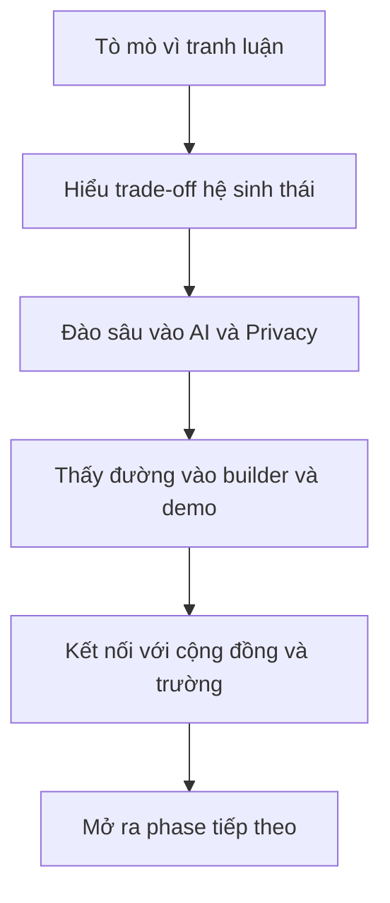

# Future Builders Series
## Cardano x Solana x AI x Privacy x Student Community

> Bản brainstorming định hướng ở mức concept, phục vụ thảo luận nội bộ, làm việc với đối tác, speaker, nhà tài trợ, và chốt khung chương trình.  
> Đây là bản thiên về **ý tưởng và cấu trúc tổng thể**, chưa khóa toàn bộ chi tiết triển khai.  
> Một số chi tiết cụ thể có thể tiếp tục được đặt câu hỏi và làm rõ thêm ở bước sau.

---

## 1. Tóm tắt định hướng

Đây là đề xuất cho một **chuỗi 4-5 sự kiện** xoay quanh các trục:

- Cardano
- Solana
- AI
- Privacy
- Student / Developer Community
- Cross-chain dialogue

Điểm quan trọng là chuỗi này **không nên bị nhìn như các workshop rời rạc**, mà phải được thiết kế như một **hành trình nội dung có logic**:

1. Thu hút bằng một chủ đề có tính tranh luận và đối lập rõ
2. Đào sâu bằng một chủ đề có chiều sâu công nghệ và giá trị dài hạn
3. Chuyển từ nghe sang chạm tay, demo, builder mindset
4. Mở rộng sang cộng đồng sinh viên, trường đại học, và kết nối mạng lưới
5. Kết thúc bằng một format online, recap, AMA, hoặc tổng kết định hướng tiếp theo

Mục tiêu không chỉ là “làm event”, mà là:

- tạo một narrative đủ mạnh để kéo audience chất lượng
- giảm rào cản entry cho người mới
- tạo tài sản nội dung lâu dài
- tạo nền cho sponsor / partner / community expansion
- thử nghiệm một mô hình community funnel có thể nhân rộng

---

## 2. Luận điểm trung tâm của chuỗi

Luận điểm mạnh nhất của concept này không phải là:

> Cardano thắng hay Solana thắng

Mà là:

> Trong tương lai công nghệ, người xây dựng cần hiểu **trade-off giữa các hệ**, hiểu **vai trò của AI**, hiểu **tại sao privacy sẽ trở nên ngày càng quan trọng**, và biết cách bước từ tò mò sang hành động thực tế.

Chuỗi này vì vậy nên được đóng gói như một chương trình:

- có chất lượng trí tuệ
- không maximalism
- không shill tài chính
- có tính học thuật nhưng vẫn dễ vào
- có tính thực chiến cho dev và student
- có khả năng kết nối nhiều hệ sinh thái mà không đánh mất bản sắc

---

## 3. Mục tiêu chiến lược

### 3.1. Mục tiêu ngắn hạn

- tạo sức hút ban đầu cho cộng đồng bằng một chủ đề đủ nóng
- kéo thêm audience ngoài cộng đồng hiện hữu
- tạo không gian đối thoại chất lượng giữa Cardano, Solana, AI, privacy
- hình thành một nhóm người theo dõi chuỗi từ đầu đến cuối
- có tài liệu và narrative đủ tốt để xin tài trợ hoặc mở rộng

### 3.2. Mục tiêu trung hạn

- xây một cộng đồng liên chuỗi nhưng có chiều sâu
- kết nối speaker, dev, sinh viên, community operator
- tạo pipeline từ người mới quan tâm đến builder hoặc contributor
- tạo model event có thể tái sử dụng cho campus, city, hoặc community khác

### 3.3. Mục tiêu dài hạn

- hình thành một series có thể trở thành thương hiệu riêng
- phát triển thành builder circle, student chapter, hoặc thematic community
- làm nền cho các chương trình sâu hơn như study group, hack session, lab discussion, hoặc small cohort

---

## 4. Định vị tổng thể

### 4.1. Định vị cốt lõi

Đây là một chuỗi sự kiện giáo dục và kết nối cộng đồng, khám phá tương lai blockchain qua các lăng kính:

- kiến trúc hệ thống
- decentralization vs performance
- AI
- privacy
- builder experience
- student and community engagement

### 4.2. Điều chuỗi này **không nên** trở thành

- buổi shill token
- buổi tranh cãi hệ phái kiểu fan war
- workshop quá nặng kỹ thuật khiến người mới không theo được
- event nói quá rộng nhưng không để lại gì
- chuỗi có nhiều hoạt động nhưng thiếu narrative xuyên suốt

### 4.3. Điều chuỗi này **nên** trở thành

- một hành trình nội dung có tension, có chiều sâu, có điểm chạm thực hành
- một không gian đối thoại có chất lượng
- một cây cầu giữa người mới, dev, student, và community
- một mô hình để sponsor thấy ROI cộng đồng rõ ràng
- một nơi mà người tham gia cảm thấy họ được “mở góc nhìn” chứ không chỉ đi nghe cho biết

---

## 5. Vì sao concept này có tiềm năng

### 5.1. Có hook tốt

Cardano và Solana là hai hệ có triết lý, cấu trúc, và hình ảnh cộng đồng rất khác nhau.  
Sự đối lập này tạo ra một điểm vào rất mạnh cho audience.

### 5.2. Có chiều sâu thật

Nếu chỉ dừng ở debate, chuỗi sẽ nông.  
Nhưng khi nối sang Midnight, privacy, AI, builder demo, thì chuỗi có thể đi từ tranh luận sang tư duy hệ thống.

### 5.3. Có khả năng kéo nhiều nhóm người

- người tò mò vì debate
- dev tò mò vì demo
- student tò mò vì career / technology future
- community operator tò mò vì cross-chain dialogue
- ecosystem people tò mò vì positioning

### 5.4. Có khả năng tạo tài sản dài hạn

Mỗi buổi có thể sinh ra:

- video recap
- short clips
- insight post
- discussion prompts
- cộng đồng Telegram / Meetup / channel follow-up
- slide, repo, starter kit, note summary

### 5.5. Có thể co giãn theo ngân sách

- có tài trợ thì nâng cấp venue, media, speaker
- không có tài trợ vẫn có thể chạy ở format nhỏ, chất lượng, tại quán cà phê hoặc không gian gọn hơn

---

## 6. Nhóm audience mục tiêu

### 6.1. Sinh viên công nghệ

Bao gồm:

- sinh viên CNTT
- AI / Data / Software
- sinh viên quan tâm công nghệ mới
- người đang tìm hướng đi ngoài curriculum chính khóa

Họ cần:

- cách vào dễ hiểu
- chủ đề đủ cuốn
- cảm giác nội dung “xịn” và có giá trị thật
- thấy được lộ trình sau khi tham gia

Rủi ro:

- bị ngợp nếu quá technical
- bỏ đi nếu event quá chung chung

### 6.2. Dev trẻ / builder web2

Họ không muốn nghe những thứ quá marketing.  
Họ quan tâm đến:

- kiến trúc
- tooling
- trade-off
- real-world building
- demo
- dev experience

Rủi ro:

- nếu chuỗi quá thiên narrative mà không có technical depth, họ sẽ mất hứng

### 6.3. Community / operator / growth-oriented audience

Đây là nhóm thích các chủ đề mới, thích network, thích hiểu narrative, thích kết nối.

Họ quan tâm đến:

- câu chuyện lớn
- sự dịch chuyển công nghệ
- vai trò của AI / privacy / community
- kết nối với người trong ngành

Rủi ro:

- nếu quá kỹ thuật, họ sẽ bị loại khỏi cuộc chơi

### 6.4. Ecosystem insiders

Bao gồm người từ:

- Cardano community
- Solana community
- privacy / AI / blockchain circles

Họ đem lại chất lượng thảo luận và credibility, nhưng cũng là nguồn rủi ro maximalism.

---

## 7. Câu chuyện lớn của toàn chuỗi

Chuỗi này mạnh nhất khi được kể theo logic sau:

> Buổi đầu dùng tranh luận để kéo người vào  
> Buổi hai đi vào vấn đề cốt lõi hơn của tương lai công nghệ: privacy và AI  
> Buổi ba cho người tham gia chạm tay vào builder mindset và demo  
> Buổi bốn đưa câu chuyện ra khỏi ecosystem nội bộ để kết nối sinh viên và trường  
> Buổi năm tổng kết và mở ra hướng đi tiếp theo

Tức là chuỗi không phải là 5 event song song, mà là một **arc phát triển nhận thức**:

## 8. Khung 5 sự kiện

### 8.1. Event 1
# Battle / Debate: Cardano vs Solana

#### Vai trò

Đây là **hook lớn nhất** của chuỗi.  
Nó phải đủ mạnh để:

- kéo người mới
- tạo tranh luận
- gợi tò mò
- sinh ra nội dung media
- khiến audience muốn quay lại buổi 2

#### Giá trị của buổi này

- tạo chú ý nhanh
- tạo cảm giác đây là chuỗi “có vấn đề thật để bàn”
- đặt nền rằng blockchain không chỉ là hype, mà là tập hợp các trade-off

#### Các hướng nội dung

- Decentralization vs performance
- Academic rigor vs tốc độ triển khai
- Security vs user adoption
- Governance vs speed of execution
- Developer experience
- Ecosystem growth
- Long-term sustainability
- Chain nào phù hợp hơn cho thế hệ AI-driven applications

#### Format có thể cân nhắc

| Format | Mô tả | Ưu điểm | Rủi ro |
|---|---|---|---|
| Debate chính thức | chia phe, có moderator, có round | căng, rõ tension, dễ kéo người | dễ thành fan war |
| Panel battle | đối thoại có kiểm soát | dễ mềm hóa, dễ giữ không khí | tension có thể yếu hơn |
| Hybrid | panel có round phản biện rõ | cân bằng giữa chiều sâu và độ hấp dẫn | moderator phải chắc |

#### Câu hỏi có thể đào sâu thêm

- Có nên framing đây là “battle” thật hay “dialogue with tension”?
- Audience mục tiêu của buổi này nghiêng beginner hay intermediate?
- Có cần live voting đầu buổi và cuối buổi để tăng tương tác?
- Speaker bên Solana nên là technical hay community-facing?

---

### 8.2. Event 2
# Midnight, Privacy, và AI: Ai nên là chủ đạo?

#### Vai trò

Đây là buổi giúp chuỗi **chuyển từ hấp dẫn sang có chiều sâu**.  
Nếu buổi 1 là thứ kéo người vào, thì buổi 2 là thứ khiến họ nhận ra chuỗi này không nông.

#### Giá trị của buổi này

- định vị chiều sâu công nghệ
- mở ra câu chuyện khác biệt hơn so với các event blockchain thông thường
- gắn Midnight vào một vấn đề thật sự có tương lai: privacy trong thời đại AI

#### Trục nội dung chính

- Privacy có phải là lớp hạ tầng bắt buộc của tương lai số?
- Khi AI ngày càng phụ thuộc vào dữ liệu, ai kiểm soát dữ liệu đó?
- Public-by-default có thật sự phù hợp với mọi loại ứng dụng?
- Selective disclosure có thể trở thành một mô hình quan trọng thế nào?
- Midnight đang đại diện cho loại tư duy hạ tầng nào?

#### Cách hiểu câu “AI nên là chủ đạo”

Có thể diễn giải theo hai hướng:

| Hướng hiểu | Ý nghĩa |
|---|---|
| AI là hook chính | dễ truyền thông, dễ kéo audience rộng |
| Privacy là nền sâu hơn | tạo chiều sâu, khác biệt, và định vị dài hạn hơn |

Có thể không cần chốt một bên thắng, mà dùng chính tension này làm xương sống cho buổi thảo luận.

#### Câu hỏi có thể đào sâu thêm

- Buổi này thiên keynote, panel, hay workshop thought experiment?
- Có cần speaker từ phía privacy / AI ngoài blockchain để mở rộng góc nhìn không?
- Có nên làm buổi này ít chain-specific hơn để tăng tính học thuật?

---

### 8.3. Event 3
# Live Coding / Builder Demo / Vibe Coding liên quan crypto

#### Vai trò

Đây là buổi chuyển hóa từ:

- nghe hiểu
- sang thấy được đường vào
- sang cảm giác “mình cũng có thể bắt đầu”

#### Giá trị của buổi này

- giảm entry barrier cho dev
- chứng minh chuỗi không chỉ nói chuyện lý thuyết
- tạo asset kỹ thuật như repo, starter kit, demo
- giúp kéo audience technical ở lại trong chuỗi

#### Các hướng có thể đi

| Hướng | Mô tả concept |
|---|---|
| Cardano starter path | demo một đường vào đơn giản cho builder mới |
| Hydra API demo | nhấn mạnh việc có thể thử mà không cần local setup nặng |
| AI x crypto builder flow | dùng AI để hỗ trợ đọc docs, scaffold project, giải thích kiến trúc |
| Cross-chain comparison demo | so sánh trải nghiệm làm một tác vụ cơ bản trên hai hệ |
| Privacy-aware app concept | mockup một ứng dụng có yếu tố AI + privacy + blockchain |

#### Điểm quan trọng

Buổi này không nhất thiết phải quá hardcore.  
Nếu audience hỗn hợp, format tốt hơn có thể là:

- live coding vừa phải
- demo có giải thích
- architecture explanation
- starter kit / repo / next step

Thay vì bắt mọi người phải cài môi trường phức tạp.

#### Câu hỏi có thể đào sâu thêm

- Mục tiêu là “wow demo” hay “có thể tự làm tiếp sau buổi này”?
- Demo nên nghiêng Cardano, cross-chain, hay AI-assisted builder workflow?
- Có cần chia buổi này thành technical part và non-technical explanation part không?

---

### 8.4. Event 4
# Kết nối sinh viên / Đại học / cộng đồng campus

#### Vai trò

Đây là buổi mở rộng chuỗi ra khỏi phạm vi cộng đồng chain hiện tại.  
Nó giúp series có:

- legitimacy
- chiều rộng
- khả năng nhân rộng
- pipeline cho student network

#### Giá trị của buổi này

- kết nối với trường đại học
- mở đường cho collaboration dài hạn
- tìm partner student club / tech club
- giúp câu chuyện chuỗi không bị bó hẹp trong một ecosystem meetup

#### Các hướng nội dung

- Sinh viên công nghệ nên nhìn blockchain và AI như thế nào?
- Có cần học blockchain từ bây giờ hay chờ thị trường trưởng thành hơn?
- Những kỹ năng nào đang trở nên quan trọng trong bối cảnh AI thay đổi cách lập trình?
- Làm sao đi từ attendee sang contributor hoặc builder?

#### Các format có thể cân nhắc

| Format | Mô tả |
|---|---|
| Campus panel | thảo luận định hướng và cơ hội |
| Student showcase | mời nhóm sinh viên chia sẻ project / góc nhìn |
| Roundtable networking | chia bàn theo chủ đề |
| Mini orientation | map các đường đi: học, build, tham gia community |

#### Câu hỏi có thể đào sâu thêm

- Buổi này nên đặt tại trường hay venue trung lập?
- Có nên mời đại diện nhiều trường cùng tham gia?
- Mục tiêu chính là branding, tuyển người, hay partnership lâu dài?

---

### 8.5. Event 5
# Online closing / AMA / recap / mở hướng tiếp theo

#### Vai trò

Đây là buổi **khóa mạch** của cả chuỗi.  
Nó giúp series không bị rơi vào kiểu làm xong rồi tan.

#### Giá trị của buổi này

- tổng hợp insight
- mở rộng reach online
- mời speaker khó mời offline
- dẫn sang phase 2 như builder circle, chapter, workshop chuyên đề, hoặc series mùa sau

#### Các format có thể cân nhắc

| Format | Ý nghĩa |
|---|---|
| AMA online | gần gũi, linh hoạt, tiết kiệm |
| Fireside chat | phù hợp nếu mời được guest có chất lượng |
| Recap and synthesis | gom lại logic của cả series |
| Community showcase | nếu có người tham gia thử build / thử nghiên cứu |
| Outlook session | nói về cái gì nên làm tiếp sau chuỗi |

#### Câu hỏi có thể đào sâu thêm

- Buổi này có cần speaker quốc tế hay không?
- Có nên dùng như dịp công bố step tiếp theo của community?
- Có muốn tạo “season 2 hook” ngay từ buổi này không?

---

## 9. Vai trò của AI xuyên suốt chuỗi

Điểm “mọi buổi đều có AI” cần được hiểu như một **logic xuyên suốt**, chứ không phải chỉ thêm chữ AI vào tiêu đề.

### 9.1. AI trong từng event

| Event | Vai trò của AI |
|---|---|
| Event 1 | một lăng kính để hỏi chain nào phù hợp hơn cho tương lai ứng dụng |
| Event 2 | động lực làm privacy trở thành vấn đề cấp thiết |
| Event 3 | công cụ giảm rào cản cho builder và demo workflow mới |
| Event 4 | yếu tố thay đổi career path và định hướng học tập |
| Event 5 | nền cho câu hỏi tương lai: AI, trust, privacy, coordination |

### 9.2. Luận điểm bao quát

AI không chỉ là công nghệ “đi kèm”, mà là thứ làm lộ rõ nhiều vấn đề nền tảng:

- dữ liệu thuộc về ai
- quyền riêng tư được bảo vệ như thế nào
- hệ nào phù hợp cho ứng dụng thế hệ mới
- builder sẽ làm việc khác đi ra sao
- sinh viên nên chuẩn bị kỹ năng gì

---

## 10. Định vị Cardano và Solana trong narrative

Không nên framing theo kiểu so sánh đơn giản ai hơn ai.  
Tốt hơn là xem hai hệ như đại diện cho hai triết lý rất khác nhau.

| Khía cạnh | Cardano | Solana |
|---|---|---|
| Hình ảnh chung | an toàn, học thuật, phi tập trung | nhanh, nhiều user, execution mạnh |
| Narrative mạnh | rigor, governance, resilience | speed, UX, growth |
| Điểm dễ gây tranh luận | chậm, khó vào với người mới | tập quyền hơn, trade-off mạnh |
| Giá trị khi đặt cạnh nhau | buộc audience nghĩ về nền móng | buộc audience nghĩ về scale và adoption |

Điểm hay nhất là không cần ép audience chọn phe, mà ép họ phải nghĩ về câu hỏi:

> Khi xây thứ gì đó thật, ta đang tối ưu cho điều gì?

---

## 11. Tên chuỗi và umbrella concept

Có thể cân nhắc một tên umbrella để tạo cảm giác đây là một chương trình trọn vẹn.

### 11.1. Một số hướng tên

- Future Builders Series
- Cross-Chain Builders Series
- Beyond Maximalism
- Build Across Chains
- AI x Blockchain Student Series
- Privacy, Performance, and the Future

### 11.2. Hướng phù hợp hơn

Một tên như **Future Builders Series** có lợi vì:

- đủ rộng để chứa Cardano, Solana, AI, privacy, student
- không bị tribal
- có thể dùng lại cho mùa sau
- nghe phù hợp với sponsor và môi trường học thuật hơn

### 11.3. Câu hỏi có thể đào sâu thêm

- Có cần tên tiếng Việt song song hay chỉ dùng tiếng Anh?
- Tên nên nghiêng tech, community, hay student?
- Có muốn giữ chữ Cardano và Solana trong sub-title thay vì title chính không?

---

## 12. Giá trị cho sponsor / partner

Nếu đi xin quỹ hoặc tài trợ, concept này cần được kể không phải là “xin tiền để làm workshop”, mà là:

> đầu tư vào một mô hình giáo dục và xây cộng đồng có chiều sâu, có khả năng tạo tài sản nội dung và phát hiện builder / contributor tương lai.

### 12.1. Sponsor có thể nhận được gì

- tiếp cận student và dev quality
- narrative tích cực quanh giáo dục và công nghệ
- content asset tái sử dụng
- dấu ấn hiện diện trong một chuỗi có chiều sâu hơn event đơn lẻ
- cơ hội network với partner trường / cộng đồng địa phương

### 12.2. Các nguồn lực có thể nghĩ đến

- Cardano-linked support
- proposal gửi Solana Foundation
- sponsor bên thứ ba
- venue partner
- mô hình bán vé nhẹ để lọc audience
- in-kind support về media, địa điểm, nhân lực

### 12.3. Câu hỏi có thể đào sâu thêm

- Sponsor cần deck 1 trang hay memo chi tiết hơn?
- Kể câu chuyện theo hướng education impact hay ecosystem expansion?
- Cần có số liệu target sơ bộ để tăng tính thuyết phục không?

---

## 13. Mô hình vé và lọc audience

Vé không chỉ là nguồn tiền nhỏ, mà còn là công cụ định hình chất lượng audience.

### 13.1. Lý do nên cân nhắc bán vé

- giảm no-show
- tăng cảm giác có giá trị
- lọc người thực sự quan tâm
- chia sẻ chi phí vận hành

### 13.2. Rủi ro khi bán vé

- giảm số người tham dự
- sinh viên ngại trả tiền
- nếu brand chưa đủ mạnh thì conversion có thể thấp

### 13.3. Các hướng có thể cân nhắc

| Mô hình | Ý nghĩa |
|---|---|
| free registration | kéo top-of-funnel |
| vé thấp | lọc nhẹ nhưng vẫn dễ vào |
| combo series | kéo retention |
| free for selected students | mở rộng campus mà vẫn giữ chất lượng |
| deposit model | hạn chế no-show |

### 13.4. Câu hỏi có thể đào sâu thêm

- Mục tiêu là đông người hay đúng người?
- Buổi 1 có nên free để kéo awareness, sau đó lọc dần?
- Giá 100k có đủ hợp lý nếu nhấn vào chiều sâu nội dung và networking?

---

## 14. Vận hành theo hai kịch bản

### 14.1. Plan A: Có tài trợ

Khi có tài trợ, chuỗi có thể hướng tới:

- venue tốt hơn
- media chỉn chu
- speaker support tốt hơn
- branding thống nhất
- trải nghiệm chuyên nghiệp hơn
- quy mô attendance lớn hơn

### 14.2. Plan B: Lean format / tự cân

Nếu không xin được tiền hoặc funding chưa về kịp, chuỗi vẫn có thể chạy ở format nhỏ:

- venue quán cà phê
- không gian intimate
- số lượng ít hơn nhưng chất lượng hơn
- nội dung vẫn giữ chuẩn
- tập trung vào discussion và continuity hơn là hình thức lớn

### 14.3. Điểm mạnh của plan lean

- ít rủi ro tài chính
- dễ thử nghiệm
- dễ điều chỉnh sau buổi đầu
- giữ được tinh thần community thật

### 14.4. Câu hỏi có thể đào sâu thêm

- Nếu plan lean thì buổi nào nên chạy trước?
- Có nên thử pilot một buổi trước khi commit full series?
- Venue cà phê cần đáp ứng các tiêu chí gì để không làm giảm chất lượng trải nghiệm?

---

## 15. Rủi ro chính của chuỗi

### 15.1. Rủi ro maximalism / fan war

#### Nguy cơ

- audience hoặc speaker kéo câu chuyện thành tribal battle
- mất chất lượng học thuật
- người ngoài cảm thấy khó chịu hoặc xa lạ

#### Cách nhìn

Đây là rủi ro narrative lớn nhất ở buổi 1.

### 15.2. Rủi ro nội dung bị quá nông

#### Nguy cơ

- debate chỉ tạo ồn ào nhưng không để lại gì
- audience không quay lại các buổi sau

#### Cách nhìn

Nếu không nối tốt sang Event 2 và Event 3, chuỗi sẽ gãy mạch.

### 15.3. Rủi ro quá khó với người mới

#### Nguy cơ

- privacy, Midnight, live coding đều có thể khó
- sinh viên chưa có nền sẽ bị rớt lại

#### Cách nhìn

Mỗi buổi cần có cách dẫn nhập nhiều tầng.

### 15.4. Rủi ro funding và nhân sự

#### Nguy cơ

- sponsor chậm
- speaker chốt muộn
- media không đủ người
- vận hành thiếu owner rõ ràng

### 15.5. Rủi ro chuỗi không có follow-up

#### Nguy cơ

- người tham gia đến xong rồi rời đi
- không có group, không có step tiếp theo, không có pipeline

### 15.6. Câu hỏi có thể đào sâu thêm

- Ai là moderator đủ mạnh để giữ không khí?
- Mỗi buổi có owner rõ ràng chưa?
- Sau buổi 3 hoặc buổi 5, community sẽ đi về đâu?

---

## 16. Cấu trúc đội ngũ tối thiểu

Để chuỗi này có thể vận hành, cần ít nhất các vai trò sau:

| Vai trò | Trọng tâm |
|---|---|
| Content lead | khung nội dung, câu hỏi, briefing speaker |
| Partnership / sponsor lead | đối tác, quỹ, speaker outreach |
| Operations lead | venue, timeline, logistics |
| Media lead | recap, clip, social asset |
| Host / moderator | giữ nhịp chương trình và chất lượng đối thoại |

Nếu team mỏng, ít nhất vẫn phải rõ ai chịu trách nhiệm chính cho:

- nội dung
- đối tác
- vận hành
- media

---

## 17. Chỉ số thành công nên nghĩ tới

Dù đây mới là brainstorm concept, vẫn nên định hình sớm một số hướng đo thành công.

### 17.1. Chỉ số đầu vào

- số lượng đăng ký
- chất lượng đăng ký
- mức độ quan tâm của partner / speaker / sponsor

### 17.2. Chỉ số trong chuỗi

- số người thực đến
- số người quay lại buổi sau
- chất lượng câu hỏi và tương tác
- mức độ tham gia group hoặc community channel

### 17.3. Chỉ số đầu ra

- số content asset tạo được
- số partner mới kết nối được
- số người muốn tiếp tục builder path
- khả năng mở phase tiếp theo

### 17.4. Câu hỏi có thể đào sâu thêm

- Sponsor quan tâm nhất attendance hay retention?
- Team muốn chứng minh impact bằng số lượng hay bằng chiều sâu?
- Có cần một form survey chuẩn để đo perception shift sau chuỗi không?

---

## 18. Giá trị đặc biệt của concept này

Điểm mạnh nhất của chuỗi không nằm ở chỗ tổ chức nhiều buổi, mà ở chỗ kết nối được nhiều tầng giá trị trong cùng một narrative:

- tension giữa hai ecosystem
- chiều sâu của privacy
- độ thời sự của AI
- tính thực hành của builder demo
- sức lan của student community
- khả năng mở rộng thành mô hình dài hạn

Nói cách khác, nếu làm tốt, đây không chỉ là một chuỗi event, mà là:

> một community funnel được ngụy trang dưới dạng chương trình nội dung hấp dẫn

---

## 19. Tóm tắt một đoạn để gửi nội bộ

Đây là một chuỗi sự kiện định hướng giáo dục và kết nối cộng đồng, dùng tranh luận giữa Cardano và Solana để tạo điểm vào mạnh, sau đó mở rộng sang AI, privacy, builder demo, và kết nối sinh viên để tạo chiều sâu và tính bền vững. Điểm cốt lõi không phải là chọn phe, mà là giúp người tham gia hiểu trade-off hệ thống, thấy được các vấn đề nền của tương lai công nghệ, và có đường đi tiếp từ tò mò sang builder mindset hoặc community engagement. Nếu vận hành tốt, chuỗi này có thể trở thành mô hình có thể lặp lại cho campus, partner community, hoặc các mùa tiếp theo.

---

## 20. Next steps ở mức concept

Ở bước hiện tại, các việc quan trọng chưa phải là khóa hết chi tiết, mà là làm rõ một số câu hỏi nền:

1. Chuỗi này muốn được nhớ đến như một series về:
   - cross-chain dialogue
   - AI x privacy
   - builder onboarding
   - student ecosystem
   - hay kết hợp cả bốn theo một narrative thống nhất

2. Buổi 1 có muốn thực sự dùng chữ “battle” hay đổi sang một framing mềm hơn?

3. Event 2 sẽ đặt trọng tâm vào:
   - Midnight
   - privacy như hạ tầng
   - hay AI vs privacy như một tension lớn hơn

4. Event 3 hướng tới:
   - demo để truyền cảm hứng
   - hay starter path đủ thực dụng để người tham gia có thể làm tiếp

5. Event 4 ưu tiên:
   - branding với trường
   - recruiting
   - hay partnership dài hạn

6. Event 5 có vai trò là:
   - closing đơn thuần
   - hay bàn đạp mở sang phase 2

7. Về tổng thể, chuỗi này muốn tối ưu:
   - attendance
   - chất lượng audience
   - media asset
   - community continuity
   - hay sponsor credibility

---

## 21. Kết luận

Phiên bản mạnh nhất của concept này không phải là một chuỗi workshop blockchain thông thường.

Phiên bản mạnh nhất là:

> một chuỗi nội dung có tension, có chiều sâu, có tính builder, có tính campus, và có khả năng nối Cardano, Solana, AI, và privacy thành một câu chuyện đủ mạnh để thu hút, đủ sâu để giữ chân, và đủ mở để phát triển thành cộng đồng thật.

Nếu làm đúng, đây không chỉ là 4-5 buổi sự kiện.  
Đây có thể là hạt mầm của một hệ sinh thái cộng đồng nhỏ nhưng chất lượng, nơi người tham gia không chỉ đến để nghe, mà đến để hiểu, kết nối, và tiếp tục bước đi sau đó.
