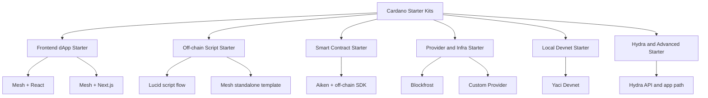
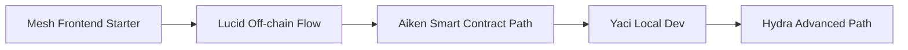

# STARTERKIT.md

# Cardano Starter Kit Reference
## Các hướng starter kit, scaffold, và bộ công cụ khởi đầu cho Cardano

> Tài liệu này tổng hợp các **starter kit**, **toolchain**, và **đường vào phát triển** phía Cardano để dùng cho workshop, live coding, builder onboarding, hoặc demo trong chuỗi sự kiện.  
> Mục tiêu không phải liệt kê mọi công cụ có thể có, mà là chỉ ra:
> - nên bắt đầu từ đâu
> - stack nào phù hợp cho loại demo nào
> - complexity ra sao
> - có thể kết hợp những gì

---

## 1. Cách hiểu “starter kit” trong ngữ cảnh Cardano

Trong ngữ cảnh thực tế, “starter kit” phía Cardano không chỉ là một repo template duy nhất. Nó thường rơi vào một trong các nhóm sau:

1. **SDK khởi đầu để build dApp nhanh**
2. **Template frontend + wallet integration**
3. **Smart contract path**
4. **Provider / infra path**
5. **Local dev / test path**
6. **Layer 2 / advanced builder path**

Cardano Developer Portal hiện gom các công cụ builder theo hướng “from the first transaction to the production dApp”, còn Mesh định vị rõ là TypeScript SDK để bắt đầu dApp trong vài phút với transaction builder, wallet connectors, React components, smart contract tools, Hydra, Yaci, và cả Midnight-related integrations. ([developers.cardano.org](https://developers.cardano.org/?utm_source=chatgpt.com))

---

## 2. Bản đồ starter kit ở mức khái niệm

## 3. Các nhóm starter kit chính

### 3.1. Frontend dApp starter

Đây là hướng phù hợp nhất cho:

- workshop sinh viên
- live coding buổi ngắn
- demo có ví, connect wallet, query asset, submit transaction
- onboarding audience hỗn hợp

#### Các lựa chọn nổi bật

| Starter direction | Thành phần chính | Dùng để làm gì | Complexity |
|---|---|---|---|
| Mesh + Next.js starter | Next.js + Mesh SDK + wallet integration | build Cardano dApp frontend nhanh | Low-Medium |
| Mesh + React components | React + wallet hooks + UI components | connect wallet, hiển thị asset, transaction flow | Low-Medium |
| Mesh full dApp path | Mesh core + provider + React | app demo có UX hoàn chỉnh | Low-Medium |

Mesh có guide chính thức để “Build Your First Cardano dApp with Next.js”, trong đó nhấn mạnh connect wallet, query assets, và build blockchain app bằng Next.js + Mesh SDK. Mesh React cũng có bộ component và hooks để kết nối ví, hiển thị balances, và xây signing flow cho nhiều ví CIP-30.

#### Khi nào nên chọn hướng này

- cần demo nhanh
- audience chưa quen eUTXO
- muốn kết quả nhìn thấy được trên UI
- muốn focus vào trải nghiệm builder thay vì logic on-chain sâu

---

### 3.2. Off-chain script starter

Đây là hướng phù hợp nếu không muốn dựng cả frontend, mà chỉ muốn:

- viết script TypeScript
- build transaction
- test nhanh logic off-chain
- demo đọc dữ liệu chain hoặc submit transaction

#### Các lựa chọn nổi bật

| Starter direction | Thành phần chính | Dùng để làm gì | Complexity |
|---|---|---|---|
| Lucid script starter | Lucid + provider + wallet selection | script off-chain gọn nhẹ | Low-Medium |
| Mesh standalone template | TypeScript + `@meshsdk/core` + `tsx` | chạy script độc lập | Low-Medium |
| Headless wallet flow | Mesh + headless/server-side wallet | automation hoặc backend-like demos | Medium |

Mesh có guide “Run Standalone Cardano Scripts with TypeScript” và cung cấp cả template repo để bắt đầu nhanh; quick start của guide này clone template, cài dependencies, cấu hình `.env`, rồi chạy script TypeScript trực tiếp. Lucid thì tập trung vào transaction construction, provider integration, wallet selection, rất hợp cho off-chain scripting path.

#### Khi nào nên chọn hướng này

- buổi live coding ngắn
- muốn tránh frontend noise
- muốn giải thích transaction building rõ hơn
- muốn demo “Cardano không khó vào như tưởng tượng”

---

### 3.3. Smart contract starter

Đây là hướng khi muốn có một bộ starter kit đi từ:

- viết contract
- compile
- test
- nối với off-chain code
- chạy demo lock / unlock / mint / vesting đơn giản

#### Các lựa chọn nổi bật

| Starter direction | Thành phần chính | Dùng để làm gì | Complexity |
|---|---|---|---|
| Aiken starter | Aiken CLI + validator project | viết on-chain validator | Medium |
| Aiken + Mesh | Aiken contract + Mesh off-chain | full flow contract + interaction | Medium-High |
| Aiken + Lucid | Aiken validator + Lucid tx builder | on-chain + off-chain separation rõ | Medium-High |

Developer Portal mô tả Aiken là công cụ tập trung riêng cho on-chain validator scripts, còn các phần off-chain như transaction building, wallet integration, UI thì dùng các tool khác trong hệ Cardano. Mesh có guide “Build Your First Aiken Smart Contract” và các guide như vesting cho flow khá đầy đủ: định nghĩa datum, viết validator, test, build với `aiken build`, rồi nối sang frontend hoặc off-chain helper.

#### Khi nào nên chọn hướng này

- audience đã có nền developer
- cần chứng minh Cardano có smart contract path hiện đại
- muốn cho thấy logic eUTXO rõ ràng
- chấp nhận complexity cao hơn frontend starter

---

### 3.4. Provider / infrastructure starter

Một starter kit thực tế không thể tách rời khỏi layer provider, vì dApp cần đọc chain data, protocol params, submit transaction, hoặc dùng query layer.

#### Các lựa chọn nổi bật

| Provider direction | Thành phần chính | Dùng để làm gì | Complexity |
|---|---|---|---|
| Blockfrost-based starter | Blockfrost provider + SDK | đơn giản nhất để vào Cardano infra | Low |
| Mesh unified provider path | Blockfrost, Koios, Maestro, Ogmios, UTxO RPC | đổi provider mà ít đổi app logic | Medium |
| Custom provider starter | Mesh custom provider interfaces | dùng data source riêng | Medium-High |

Mesh docs nêu rõ có unified provider API cho Blockfrost, Koios, Ogmios, Maestro, hoặc UTxO RPC; ngoài ra còn có guide để build custom provider kết nối Mesh với GraphQL endpoint, `cardano-cli`, websockets, hoặc data source riêng. Developer Portal cũng liệt kê builder tools và các hạ tầng dev liên quan.

#### Khi nào nên chọn hướng này

- cần portability giữa provider
- muốn giới thiệu kiến trúc backend hoặc infra
- muốn tránh lock-in vào một API duy nhất
- cần nói về production path hơn là chỉ workshop

---

### 3.5. Local dev / testing starter

Nếu muốn cho builder một môi trường test nhanh, local dev path là phần đáng nhắc tới.

#### Các lựa chọn nổi bật

| Starter direction | Thành phần chính | Dùng để làm gì | Complexity |
|---|---|---|---|
| Yaci-based local dev | local devnet + explorer/indexer support | test nhanh contract và tx | Medium |
| Offline evaluator / fetcher path | offline tooling trong Mesh | test và đánh giá script / tx flow | Medium |
| Custom devnet workflow | local chain + custom provider | advanced local experimentation | High |

Developer Portal liệt kê Yaci DevKit / Yaci Store như nhóm công cụ giúp tạo local Cardano devnet có indexer, explorer tối giản, và hỗ trợ provider flow; Mesh docs cũng có provider như Yaci Provider và Offline Evaluator / Offline Fetcher cho devnet và feedback loop nhanh hơn.

#### Khi nào nên chọn hướng này

- workshop kỹ thuật sâu
- muốn test mà không phụ thuộc infra public
- cần CI-like local loop
- audience đã có khả năng setup môi trường dev

---

### 3.6. Hydra / advanced starter

Đây không phải starter kit cho người mới tuyệt đối, nhưng là hướng rất đáng nhắc nếu muốn:

- phá định kiến “Cardano chỉ hợp chậm”
- nói về app tương tác nhanh
- mở ra discussion về L2, scaling, và UX

#### Các lựa chọn nổi bật

| Starter direction | Thành phần chính | Dùng để làm gì | Complexity |
|---|---|---|---|
| Hydra app concept starter | Hydra API + frontend app | app tương tác nhanh trên Cardano | High |
| Mesh + Hydra path | Mesh ecosystem mention / integration path | narrative “fast Cardano apps” | High |

Mesh hiện nêu Hydra như một hướng để build fast, low-cost Cardano apps bằng Layer 2 state channels; đây là hướng hợp để demo nâng cấp narrative, nhưng complexity cao hơn starter workshop cơ bản.

---

## 4. Bảng tổng hợp starter kit nên tham chiếu

| Kit / Direction | Công nghệ chính | Dùng cho | Output phù hợp | Complexity |
|---|---|---|---|---|
| Mesh + Next.js | Next.js, Mesh, wallet connect | dApp frontend demo | app demo có UI | Low-Medium |
| Mesh + React | React hooks, wallet UI, tx flows | student workshop | wallet demo / tx demo | Low-Medium |
| Mesh standalone template | TS, `tsx`, Mesh core | script demo | off-chain script | Low-Medium |
| Lucid starter flow | TS, Lucid, provider | tx building, query, scripting | builder live coding | Low-Medium |
| Aiken starter | Aiken CLI | validator intro | on-chain contract skeleton | Medium |
| Aiken + Mesh | Aiken + TS SDK | full contract path | lock/unlock / vesting demo | Medium-High |
| Blockfrost starter | API key + SDK/provider | simplest infra setup | query + submit path | Low |
| Mesh custom provider | custom fetcher/submitter | advanced infra | provider abstraction demo | Medium-High |
| Yaci local dev | devnet tooling | local test env | test/dev sandbox | Medium |
| Hydra app path | Hydra + app layer | advanced Cardano UX demo | fast app concept | High |

---

## 5. Combination gợi ý theo mục tiêu workshop

### 5.1. Nếu mục tiêu là “dễ demo nhất”

| Combination | Vì sao phù hợp | Complexity |
|---|---|---|
| Mesh + Next.js + wallet | có UI, dễ nhìn, dễ hiểu | Low-Medium |
| Mesh standalone template + Blockfrost | ít setup, script gọn | Low-Medium |
| Lucid + Blockfrost | logic giao dịch rõ, không cần quá nhiều UI | Low-Medium |

Mesh có cả guide Next.js lẫn standalone TypeScript script, còn Blockfrost provider path được hỗ trợ trong cả hệ builder tools lẫn SDK ecosystem hiện tại.

### 5.2. Nếu mục tiêu là “giới thiệu smart contract nghiêm túc”

| Combination | Vì sao phù hợp | Complexity |
|---|---|---|
| Aiken + Mesh | on-chain + off-chain trọn flow | Medium-High |
| Aiken + Lucid | tách vai trò rõ giữa validator và transaction building | Medium-High |

Aiken hiện được mô tả tập trung cho validator scripts, còn off-chain dùng tool khác; vì vậy pairing với Mesh hoặc Lucid là cách tự nhiên nhất cho builder path.

### 5.3. Nếu mục tiêu là “nói về production mindset”

| Combination | Vì sao phù hợp | Complexity |
|---|---|---|
| Mesh + custom provider | cho thấy abstraction layer và infra flexibility | Medium-High |
| Yaci + SDK | local dev/test path rõ hơn | Medium |
| Hydra + app layer | cho thấy scaling / UX narrative | High |

---

## 6. Starter kit nên dùng cho từng kiểu event

| Event kiểu gì | Starter kit nên ưu tiên | Lý do |
|---|---|---|
| Workshop cho sinh viên mới | Mesh + React / Next.js | dễ thấy kết quả, ví connect rõ |
| Live coding ngắn | Lucid hoặc Mesh standalone | ít setup, logic tập trung |
| Buổi builder thiên contract | Aiken + Mesh / Lucid | có chiều sâu kỹ thuật |
| Buổi nói về infra / backend | provider abstraction + custom provider | nói được trust boundary và production path |
| Buổi advanced / scale | Hydra path hoặc local devnet | khác biệt, nhưng chỉ hợp audience mạnh hơn |

---

## 7. Complexity matrix

| Starter direction | Complexity | Lý do chính |
|---|---|---|
| Blockfrost starter | Low | setup nhẹ, ít moving parts |
| Mesh frontend starter | Low-Medium | có UI nhưng abstraction tốt |
| Lucid off-chain starter | Low-Medium | gọn, rõ, hợp live coding |
| Aiken starter | Medium | thêm lớp on-chain logic |
| Aiken + off-chain integration | Medium-High | cần hiểu contract + transaction flow |
| Yaci local dev | Medium | cần local environment |
| Custom provider path | Medium-High | cần hiểu infra boundary |
| Hydra path | High | advanced narrative, setup khó hơn |

---

## 8. Recommendation ngắn gọn

### 8.1. Nếu bạn cần một “starter kit chuẩn” cho buổi demo dễ chạy nhất

Ưu tiên:

- Mesh + Next.js
- Lucid + Blockfrost
- Mesh standalone TypeScript template

Đây là ba hướng cân bằng tốt nhất giữa:

- dễ setup
- dễ giải thích
- có output rõ
- phù hợp cho audience hỗn hợp

### 8.2. Nếu bạn cần một “starter kit có chiều sâu kỹ thuật”

Ưu tiên:

- Aiken + Lucid
- Aiken + Mesh
- Yaci + SDK path

### 8.3. Nếu bạn cần một “starter kit khác biệt narrative”

Ưu tiên:

- Hydra app concept
- Custom provider architecture demo
- Aiken-based contract walkthrough

---

## 9. Kết luận

Nếu nhìn từ góc độ tổ chức workshop hoặc builder session trong chuỗi sự kiện, “Cardano starter kit” tốt nhất không nhất thiết là cái mạnh nhất về mặt kỹ thuật, mà là cái đạt cân bằng giữa:

- dễ vào
- dễ demo
- dễ giải thích
- đủ đúng với bản sắc Cardano
- mở được cửa cho bước tiếp theo

Với tiêu chí đó, bộ starter kit nên ưu tiên tham chiếu là:

- Mesh cho frontend và dApp onboarding
- Lucid cho off-chain scripting và transaction flow
- Aiken cho smart contract path
- Blockfrost cho provider đơn giản
- Yaci cho local dev
- Hydra cho narrative nâng cao về speed và UX

Nếu dùng cho chuỗi event, cách hợp lý nhất là không xem chúng như các tool riêng lẻ, mà như một **ladder of entry**:

    
